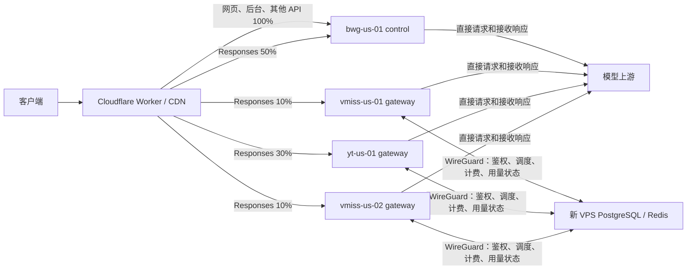
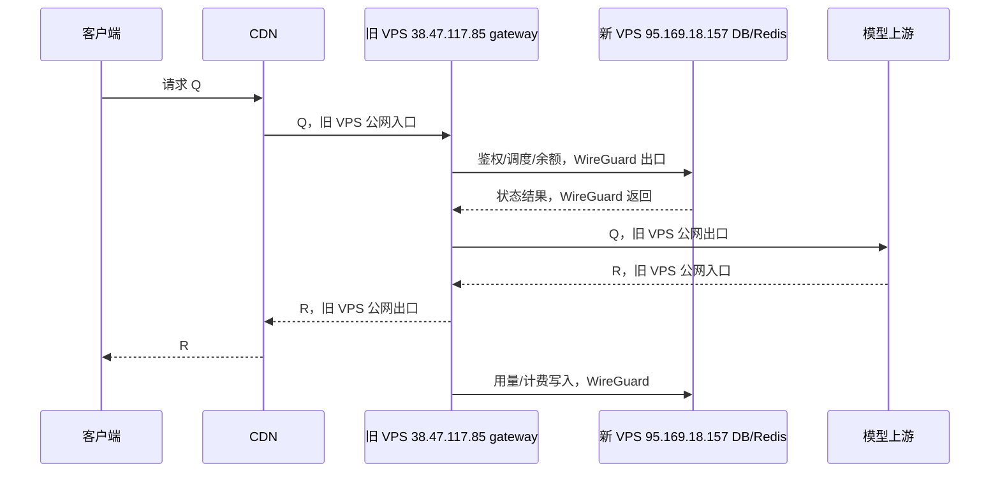

# Sub2API 多 VPS 迁移与 `/v1/responses` 分流实施记录

> 状态：已上线。完整主站和数据层位于新 VPS `95.169.18.157`；旧 VPS
> `38.47.117.85` 已降级为 Responses-only gateway；新增 VPS `154.23.243.26`
> 和 `38.47.113.166` 已作为第二、第三个 Responses-only gateway 接入。Cloudflare
> Worker 当前按 `50% bwg-us-01 / 10% vmiss-us-01 / 30% yt-us-01 / 10% vmiss-us-02`
> 分配新 Responses 请求。
>
> 数据迁移最终停机点：2026-07-31 00:02:36（Asia/Shanghai）。初始边缘 90/10
> 分流启用日期：2026-07-31；gateway154 接入后曾为 90/5/5，当前四节点比例为
> 50/10/30/10。旧数据库和旧完整应用回滚容器仍保留，但不得和新主同时运行。
>
> 最后核验日期：2026-08-01（Asia/Shanghai）。
>
> 2026-07-31 节点扩容：`154.23.243.26` 已完成 Debian 12、Docker、Nginx、
> WireGuard、Certbot、Sub2API gateway 容器和 BBR/fq 网络参数配置。新增 origin
> `gateway154-origin.xiaohondou.com` 为 DNS-only，证书有效期至 `2026-10-29`；
> gateway154 通过 `10.20.1.2/32 -> 10.20.0.1` 访问新主 PostgreSQL/Redis。
>
> 2026-08-01 新增 `38.47.113.166`，实例 ID 为 `vmiss-us-02`，通过
> `10.20.2.2/32 -> 10.20.0.1` 访问新主 PostgreSQL/Redis；四个实例均已升级到
> `0.1.169 / c81e8b2ca`，容器均启用 `no-new-privileges:true`。
>
> 2026-07-31 故障修正：多节点首版加入的全局两阶段 drain 会在容器重启时让
> control 连续返回 `503`，与当前“单容器快速重启、允许短暂中断”的发布方式不匹配。
> 仓库已恢复固定 5 秒优雅关停，并删除全局 `instance_draining` 拒绝逻辑；生产发布
> 仍须单独确认，确认前不要再次重启线上应用。

## 0. 先说结论

当前线上拓扑是：



```text
新 VPS 95.169.18.157
  = bwg-us-01 control 主节点
  = 完整 Sub2API + PostgreSQL + Redis + 管理面 + 后台任务

旧 VPS 38.47.117.85
  = vmiss-us-01 gateway 子节点
  = 只运行 /v1/responses 请求链路
  = 通过 WireGuard 访问新 VPS 的 PostgreSQL/Redis

新增 VPS 154.23.243.26
  = yt-us-01 gateway 子节点
  = 只运行 /v1/responses 请求链路
  = 通过 WireGuard 访问新 VPS 的 PostgreSQL/Redis

新增 VPS 38.47.113.166
  = vmiss-us-02 gateway 子节点
  = 只运行 /v1/responses 请求链路
  = 通过 WireGuard 访问新 VPS 的 PostgreSQL/Redis

Cloudflare Worker sub2api-responses-dispatcher
  = 不部署在任意一台 VPS 上
  = 其他请求固定到新 VPS
  = /v1/responses 在 bwg-us-01、vmiss-us-01、yt-us-01、vmiss-us-02 之间按权重选择
```

请求命中任一 gateway VPS 时，模型大流量不会绕回新 VPS：

```text
客户端 -> CDN -> gateway VPS -> 模型上游
客户端 <- CDN <- gateway VPS <- 模型上游
```

gateway 只把鉴权、调度、余额、计费和用量记录所需的状态请求通过隧道发到新 VPS：

```text
gateway VPS <-> WireGuard <-> 新 VPS PostgreSQL/Redis
```

用户前端的余额、今日用量、RPM、TPM 和费用统一从新 VPS 的共享 PostgreSQL 查询。浏览器不会分别访问四个应用节点，也不会在前端相加。

上游项目原本没有 `gateway-only` 模式。本分支已通过二开增加
`INSTANCE_ROLE=control|gateway`，角色化核心提交为 `1677984c0`；当前四个应用节点均部署
`0.1.169 / c81e8b2ca`。这不是上游原生能力，后续升级必须继续保留并回归这组改动。

### 0.1 当前关键对象

| 对象 | 当前值 |
|---|---|
| 主站域名 | `xiaohondou.com -> 95.169.18.157`，Cloudflare proxied |
| 兼容域名 | `nideyiyi.com`、`api.nideyiyi.com -> 95.169.18.157`，Cloudflare proxied |
| control origin | `control-origin.xiaohondou.com -> 95.169.18.157`，DNS-only |
| gateway origin | `gateway-origin.xiaohondou.com -> 38.47.117.85`，DNS-only |
| gateway154 origin | `gateway154-origin.xiaohondou.com -> 154.23.243.26`，DNS-only |
| gateway2 origin | `gateway2-origin.xiaohondou.com -> 38.47.113.166`，DNS-only |
| Worker | `sub2api-responses-dispatcher`，活跃版本 `f005d911-7aca-47e1-8f4d-8e6722930c09`；变量 `GATEWAY_PERCENT=10`、`GATEWAY154_PERCENT=30`、`GATEWAY2_PERCENT=10`；control 自动取剩余 50% |
| Worker 路径 | `xiaohondou.com`、`nideyiyi.com`、`api.nideyiyi.com` 上的 `/v1/responses*`、`/responses*`、`/backend-api/codex/responses*` |
| 其他路径 | 不经过 Worker，固定由新主 control 处理 |
| WireGuard | 新主 `10.20.0.1`，`vmiss-us-01=10.20.0.2/32`，`yt-us-01=10.20.1.2/32`，`vmiss-us-02=10.20.2.2/32` |
| 共享数据 relay | 新主 `10.20.0.1:5432`、`10.20.0.1:6379`，仅绑定 `wg0` 地址 |
| 最终数据库备份 | 新主 `/tmp/sub2api-final.dump`，约 162 MB |
| 备份 SHA256 | `cd94a22d13573774db9810050a5f0ca284167ff7f1dc15194659e64d0706852f` |

迁移点新旧数据库核对结果：

```text
users=391
api_keys=416
accounts=11977
usage_logs=767548
```

`usage_logs` 后续会因新请求写入和清理任务变化，以上数字只用于证明最终迁移点一致。

## 1. 四台机器的真实基线

### 1.1 新主 VPS：`95.169.18.157`

SSH 已用 `root` + `~/.ssh/id_ed25519` 通过仅 `publickey` 的非交互方式验证；当前是生产 control 主节点。

| 字段 | 已确认值 | 说明 |
|---|---|---|
| Provider | BandwagonHost KiwiVM | VM ID `2175908`，Node ID `v2923` |
| 面板位置 | `US, California` | California 是州，洛杉矶属于 California |
| IP 地理库 | `Los Angeles, California, US` | 坐标 `34.0522,-118.2437`；不替代供应商机房证明 |
| 公网 IP | `95.169.18.157` | `eth0`，网关 `95.169.16.1` |
| 反向 DNS | `95.169.18.157.16clouds.com` | 当前 PTR 结果 |
| 系统 | Debian GNU/Linux `13 (trixie)` `x86_64` | 重装后的当前实际系统 |
| CPU | `3 vCPU`，AMD EPYC-Genoa | 新主节点资源 |
| 内存 | `2.0 GiB`，swap `1.0 GiB` | 核验时可用约 `1.7 GiB` |
| 磁盘 | 根分区约 `40 GB`，ext4 | 核验时已使用约 `5%` |
| 当前监听 | 公网 `22/80/443`；本机 `127.0.0.1:8080`；WireGuard `10.20.0.1:5432/6379` | DB/Redis 未绑定公网 |
| 已安装组件 | Docker、Nginx、WireGuard、Certbot | Certbot timer 已启用 |
| 应用容器 | `sub2api` healthy | `INSTANCE_ROLE=control`、`INSTANCE_ID=bwg-us-01` |
| 数据容器 | `sub2api-postgres` healthy、`sub2api-redis` healthy | 生产权威数据层 |
| relay 容器 | `sub2api-postgres-relay`、`sub2api-redis-relay` | 只绑定 `10.20.0.1` |
| 时钟 | UTC，NTP 已同步 | 应用统一使用 `TZ=Asia/Shanghai` |

面板状态里的：

```text
Running, LA: 0.00 0.01 0.00 1/118 852
```

其中 `LA` 是 Linux load average，不是 Los Angeles。当前位置的两层证据是“供应商面板 California + IP 地理库 Los Angeles”。

### 1.2 旧 VPS：`38.47.117.85`

旧 VPS 已从原生产主节点降级为 `gateway` 子节点。2026-07-31 线上核验：

| 字段 | 已确认值 |
|---|---|
| 应用 | Sub2API `0.1.169`，commit `c81e8b2ca`，`INSTANCE_ID=vmiss-us-01` |
| 容器 | `sub2api` gateway healthy；旧 PostgreSQL/Redis 继续 healthy，仅用于回滚保留 |
| 主机资源 | `1 vCPU`，约 `1.9 GiB` RAM，swap `1 GiB` |
| 磁盘 | 根分区约 `19 GiB`，已使用 `87%`，剩余约 `2.5 GiB` |
| 数据库 | PostgreSQL 数据库约 `1943 MB` |
| Redis | `used_memory_human` 约 `9.22 MB` |
| 应用监听 | `127.0.0.1:8080` |
| gateway 目录 | `/www/sub2api-gateway` |
| gateway 数据连接 | PostgreSQL/Redis 均指向新主 `10.20.0.1` |
| 原完整应用 | `sub2api-control-rollback-20260731000236`，stopped/exited |
| 数据库/Redis公网端口 | 当前没有宿主机 port publication |

旧 VPS 磁盘已接近高水位，禁止在上面构建 Docker 镜像。旧数据库/Redis 暂未删除，
所以磁盘暂时不会明显释放；稳定观察并完成独立备份后，才能另行评估清理。

### 1.3 新增 gateway VPS：`154.23.243.26`

2026-07-31 已作为第二个 Responses-only gateway 接入。

| 字段 | 已确认值 |
|---|---|
| 系统 | Debian GNU/Linux `12 (bookworm)`，内核 `6.1.0-41-amd64`，`x86_64` |
| 主机资源 | `4 vCPU`，约 `3.8 GiB` RAM，无 swap |
| 磁盘 | 根分区约 `20 GB`，上线后已使用约 `20%`，剩余约 `16 GB` |
| 已安装组件 | Docker、docker-compose、Nginx、WireGuard、Certbot、PostgreSQL client、Redis tools |
| 应用 | Sub2API `0.1.169`，commit `c81e8b2ca`，`INSTANCE_ID=yt-us-01` |
| 容器 | `sub2api` gateway healthy，端口只绑定 `127.0.0.1:8080` |
| gateway 目录 | `/opt/sub2api-gateway-154` |
| origin | `gateway154-origin.xiaohondou.com`，DNS-only，A 记录 `154.23.243.26` |
| TLS | Let's Encrypt，证书到期日 `2026-10-29` |
| WireGuard | 本机 `10.20.1.2/32`，对端新主 `10.20.0.1/32` |
| 数据连接 | PostgreSQL/Redis 均指向新主 `10.20.0.1` |
| 网络参数 | `tcp_congestion_control=bbr`，`default_qdisc=fq`；buffer 上限 64 MiB，默认收发 buffer 32 MiB |

### 1.4 新增 gateway VPS：`38.47.113.166`

2026-08-01 已作为第三个 Responses-only gateway 接入。

| 字段 | 已确认值 |
|---|---|
| 系统 | Debian GNU/Linux `13 (trixie)`，内核 `6.12.63+deb13-cloud-amd64`，`x86_64` |
| 主机资源 | `1 vCPU`，约 `967 MiB` RAM，无 swap |
| 磁盘 | 根分区约 `10 GB`，已使用约 `29%`，剩余约 `6.6 GB` |
| 应用 | Sub2API `0.1.169`，commit `c81e8b2ca`，`INSTANCE_ID=vmiss-us-02` |
| 容器 | `sub2api` gateway healthy，端口只绑定 `127.0.0.1:8080`，`no-new-privileges:true` |
| gateway 目录 | `/opt/sub2api-gateway-2` |
| origin | `gateway2-origin.xiaohondou.com`，DNS-only，A 记录 `38.47.113.166` |
| WireGuard | 本机 `10.20.2.2/32`，对端新主 `10.20.0.1/32` |
| 数据连接 | PostgreSQL/Redis 均指向新主 `10.20.0.1` |

## 2. 当前部署表

| 位置 | 角色 | 应用 | 数据 | 对外路径 |
|---|---|---|---|---|
| `95.169.18.157` | `bwg-us-01` / `control` 主节点 | 完整 Sub2API | PostgreSQL、Redis、本地数据 | 全部非 Responses；也可承接部分 Responses |
| `38.47.117.85` | `vmiss-us-01` / `gateway` 子节点 | Responses 最小路由 | 不保存主数据库、不保存主 Redis | 按权重承接 `/v1/responses` |
| `154.23.243.26` | `yt-us-01` / `gateway` 子节点 | Responses 最小路由 | 不保存主数据库、不保存主 Redis | 按权重承接 `/v1/responses` |
| `38.47.113.166` | `vmiss-us-02` / `gateway` 子节点 | Responses 最小路由 | 不保存主数据库、不保存主 Redis | 按权重承接 `/v1/responses` |
| CDN/边缘 | dispatcher | 路径、健康、权重 | 无业务数据 | 选择一个 origin |

各应用节点必须使用同一版本、同一 commit、同一计费和安全配置。差异只允许出现在：

```text
INSTANCE_ROLE
INSTANCE_ID
DATABASE_HOST
REDIS_HOST
本机监听/反向代理
节点日志标签
```

四个节点当前均报告 `0.1.169 / c81e8b2ca`，角色化业务代码和构建产物一致。control 发布前
二进制保存在
`/opt/sub2api-control/patched-binaries/sub2api-before-0.1.168-20260730165610`，可用于直接回滚。

## 3. 迁移后的流量入口、出口和回程

设：

```text
Q = 客户端请求体
R = 模型上游响应体
S = 鉴权、调度、余额、计费、缓存和用量状态通信
```

### 3.1 请求命中新主 VPS

```text
客户端
 -> CDN
 -> 95.169.18.157 本机 Nginx
 -> control Sub2API
 -> 模型上游
 -> control
 -> Nginx
 -> CDN
 -> 客户端
```

数据库/Redis通信在新 VPS 的 Docker 内网中，只有模型上游和客户端的大流量走新 VPS `eth0`。

### 3.2 请求命中旧 VPS 子节点



这里 `R` 不经过新 VPS。新 VPS只接收 `S`，不会接收完整的模型响应流。

### 3.3 用户面板和前端入口

所有前端和面板请求固定进入新主节点：

```text
浏览器 -> CDN -> 95.169.18.157 control -> /api/v1/*
```

特别是：

```text
GET /api/v1/usage/dashboard/stats
GET /api/v1/usage/dashboard/trend
GET /api/v1/usage/dashboard/models
```

不能把这些路径分给旧 gateway，否则旧节点需要承接完整用户面板和 JWT/管理路由，失去“只处理 Codex 请求”的边界。

### 3.4 四台机器的粗略字节方向

对于命中旧 gateway 的请求：

| 节点/接口 | 入口 | 出口 | 大流量含义 |
|---|---:|---:|---|
| 旧 VPS `eth0` | `Q + R` | `Q + R` | 负责模型请求和完整响应 |
| 旧 VPS `wg0` | `S` | `S` | 共享状态，不传 `R` |
| 新 VPS `wg0` | `S` | `S` | 数据层返回和用量写入 |
| 新 VPS Docker 内网 | `S` | `S` | control/数据库/Redis本机通信 |

服务商是否把入口和出口相加，各家口径不同。最终以四台 VPS 服务商流量面板为套餐计费权威，以 `ip -s link`、Nginx 和应用日志解释组成。

## 4. 前端 RPM/TPM 是否聚合

会聚合，并且聚合点在新主 VPS 的 PostgreSQL，不是浏览器。

### 4.1 当前代码路径

用户面板请求：

```text
frontend/src/api/usage.ts
  -> GET /usage/dashboard/stats
backend/internal/handler/usage_handler.go
  -> UsageService.GetUserDashboardStats
backend/internal/repository/usage_log_repo_dashboard.go
  -> SELECT ... FROM usage_logs
```

当前代码计算口径：

| 字段 | 当前实现 |
|---|---|
| `rpm` | 最近 5 分钟该用户 `usage_logs` 记录数除以 5，整数除法 |
| `tpm` | 最近 5 分钟该用户 `input_tokens + output_tokens` 之和除以 5 |
| 今日请求/Token/费用 | 新主 PostgreSQL `usage_logs` 按用户和日期聚合 |
| 累计请求/Token/费用 | 新主 PostgreSQL `usage_logs` 按用户聚合 |
| API Key数量 | 新主 PostgreSQL `api_keys` 按用户统计 |

任一 gateway 处理完请求后，必须将计费和用量写入新主 PostgreSQL。这样新主面板自然看到四个节点的合计：

```text
vmiss-us-01 usage_logs 写入新 PostgreSQL
yt-us-01 usage_logs 写入新 PostgreSQL
vmiss-us-02 usage_logs 写入新 PostgreSQL
bwg-us-01 usage_logs 写入新 PostgreSQL
前端从新 PostgreSQL 一次查询
```

前端不会显示“bwg-us-01 5 RPM、vmiss-us-01 6 RPM”，因为 `usage_logs` 当前没有在默认聚合 UI 中展示 `instance_id` 维度。当前已保留 `usage_logs.instance_id` 记录来源，可通过管理端筛选核对四个实例。

### 4.2 TPM 不等于流量

当前用户面板 `tpm` 不包含 `cache_creation_tokens` 和 `cache_read_tokens`。Codex 长上下文大量使用缓存 Token 时，TPM 不能代表真实网卡流量，也不能作为四台 VPS 套餐配额分配依据。

### 4.3 用量可见时机

1. Responses 请求或 SSE 完成。
2. 处理请求的节点将用量任务提交给本机 worker。
3. worker 通过 WireGuard/本机内网把计费和用量写到新 PostgreSQL。
4. 用户重新进入仪表盘或点击刷新后看到合计。

当前用户仪表盘没有持续定时轮询；长请求未结束时，RPM/TPM 不会提前体现该请求。

## 5. 二开范围和真实代码边界

### 5.1 实例配置

新增配置，默认保持单机兼容：

```text
INSTANCE_ROLE=control|gateway
  INSTANCE_ID=bwg-us-01|vmiss-us-01|yt-us-01|vmiss-us-02
```

规则：

- 未配置 `INSTANCE_ROLE` 时默认为 `control`，保证现有部署行为不变。
- `control` 允许 setup、执行数据库 migration 和控制面任务。
- `gateway` 缺少既有 `data/config.yaml` 时拒绝启动；连接共享数据库后只读校验所有 migration 已由 control 应用，不执行 DDL。
- `gateway` 不注册管理面、静态前端和其它模型路由，不启动控制面定时任务。
- `RUN_MODE` 继续使用 `standard`，不能使用 `simple`，因为 `simple` 会关闭计费/额度语义。

### 5.2 gateway 必须保留的能力

旧 VPS 虽然是子节点，仍必须保留：

- API Key 鉴权。
- L1 鉴权缓存和跨实例失效订阅。
- 调度快照读取、数据库回退和全局并发限制。
- RPM/限流、账号冷却、失败状态和分布式锁。
- 请求内 Token 刷新。
- 模型上游请求、SSE、WebSocket、Responses compact 子路径。
- 余额扣减、计费幂等和用量记录 worker。
- 请求路径所需的错误记录、审计和安全检查。

不能因为旧节点“只处理 Codex”就把所有 worker 关闭；用量、并发释放、缓存失效和计费属于请求正确性。

### 5.3 gateway 必须关闭的能力

- setup wizard、数据库 migration 执行权限；gateway 只保留只读 schema 校验。
- 管理后台、登录、注册、支付、静态前端和用户面板路由。
- 定时备份、恢复调度、备份清理。
- 全量账号扫描、定时账号测试、订阅/支付过期扫描。
- 运营聚合、报表、清理和控制面告警。
- 渠道监控调度和不属于 Responses 的批量后台任务。

### 5.4 角色化改造记录

| 文件/模块 | 改造前 | 当前改动 |
|---|---|---|
| `backend/internal/config/config.go` | 没有实例角色 | 增加角色和实例 ID |
| `backend/cmd/server/main.go` | setup 在完整应用初始化前执行，关机超时固定 5 秒 | gateway 跳过 setup；保留固定 5 秒快速关停 |
| `backend/internal/server/router.go` | 无条件注册所有路由 | control 注册完整路由，gateway只注册最小 Responses/health |
| `backend/internal/server/routes/common.go` | 只有兼容 `/health` | 新增 `/health/live`、`/health/ready` |
| `backend/internal/server/routes/gateway.go` | 全部网关路由混在一个注册函数 | 提取 Responses 最小注册函数 |
| `backend/internal/service/wire.go` | 多个 Provider 构造时直接 `Start()` | 按角色统一 lifecycle，避免旧节点跑备份/聚合 |
| `backend/cmd/server/wire.go`、`wire_gen.go` | 单一完整依赖图 | 注入 role/readiness/lifecycle，重新生成 Wire |
| `backend/internal/service/usage_record_worker_pool.go` | 有界用量 worker 已存在 | gateway继续保留请求完成后的计费和用量提交 |
| `deploy/docker-compose.standalone.yml` | app-only Compose 已存在 | 增加 role、ready healthcheck 和本地 data 路径参数 |
| `deploy/docker-compose.local.yml` | 完整 app+Postgres+Redis | 增加 control role 和 ready healthcheck |
| `deploy/multi-node/` | 当前不存在 | 新增四节点 env、WireGuard、Nginx 和 control 数据端口 override 模板 |

初始迁移阶段未增加 `usage_logs.instance_id`；当前已增加该字段，用于记录并筛选
`bwg-us-01`、`vmiss-us-01`、`yt-us-01`、`vmiss-us-02` 四个实例来源。客户端 Base URL 和计费口径不变。

### 5.5 健康和顺序重启

```text
/health/live
  只证明进程和 HTTP Server 存活。

/health/ready
  检查角色、PostgreSQL和 Redis。
```

schema兼容在进程启动阶段校验：control 可执行缺失 migration；gateway 只读校验，落后或 checksum 不一致时进程拒绝启动。版本、调度快照新鲜度后续作为增强项，不在当前 ready JSON 中虚报。

任一 gateway 的 DB/Redis 隧道断开时必须由 `/health/ready` 返回 `503`。日常二进制发布不做
POST 自动转投，也不启用长时间 drain，固定按以下顺序执行：

1. 确认四个节点当前均为 ready。
2. 按 `vmiss-us-01 -> yt-us-01 -> vmiss-us-02 -> bwg-us-01` 依次替换并重启；每次只允许当前节点承接的 Responses 出现实际进程切换造成的短暂中断。
3. 每个 gateway 恢复 ready 后，确认其直接 origin 和真实 Responses 返回 `200`，再继续下一个节点。
4. 最后替换并重启 `bwg-us-01` control；前端、管理 API 和 control 承接的 Responses 只允许短暂中断。
5. 等 control 恢复 ready，复核页面数据、四节点请求和共享用量记录。

不能并行重启多个节点，也不能在一个节点尚未恢复时继续重启下一个节点。
发布脚本必须显式使用 `docker restart -t 10`，覆盖现有容器可能残留的长
`StopTimeout`；应用自身仍在 5 秒内完成优雅关停。

## 6. 新主 VPS 的实际部署

### 6.1 新机目录和组件

当前目录和组件如下：

```text
/opt/sub2api-control/
  docker-compose.yml
  .env                         # chmod 600
  data/
  postgres_data/
  redis_data/
  backups/
  patched-binaries/

/etc/nginx/sites-available/xiaohondou.com
/etc/nginx/sites-available/api.nideyiyi.com
/etc/nginx/sites-available/control-origin.xiaohondou.com
/etc/wireguard/wg0.conf
```

新主运行：

```text
Sub2API control
PostgreSQL 18
Redis 8
Nginx
WireGuard server
Certbot + systemd timer
```

数据库和 Redis 只加入 Docker 内网和 WireGuard relay，不直接绑定公网。

### 6.2 系统说明

供应商初始面板曾显示 AlmaLinux，实际迁移前已重装为 Debian 13。后续运维必须使用
`apt`/Debian 路径，不再执行旧版方案中的 `dnf` 或 `firewalld` 命令。Docker、Nginx、
WireGuard 已安装；2026-07-31 补装了 Certbot，并启用了系统续签 timer。

### 6.3 新主 Compose

新主使用完整 Compose，数据库和 Redis 不发布到公网：

```env
INSTANCE_ROLE=control
INSTANCE_ID=bwg-us-01
AUTO_SETUP=false              # 数据恢复后由既有 schema 启动
RUN_MODE=standard
DATABASE_HOST=postgres
DATABASE_PORT=5432
REDIS_HOST=redis
REDIS_PORT=6379
TZ=Asia/Shanghai
```

必须从旧生产配置复制并核对：

```text
JWT_SECRET
TOTP_ENCRYPTION_KEY
数据库用户/数据库名/密码
Redis认证
上游、计费、调度、请求体和流式超时配置
```

新主首次启动前要确认迁移后的数据库已有生产 schema，不能把空库误启动成新的生产实例。

当前运行容器报告 `0.1.169 / c81e8b2ca` 且 healthy。发布二进制已完成 SHA256 和
`linux/amd64` 校验；2026-07-31 00:56（Asia/Shanghai）经用户确认后完成直接二进制重启。
重启窗口记录到 11 个 503 和 1 个 502，最后一个发生于 `16:56:42 UTC`；`16:57 UTC`
之后的验收流量没有继续出现 5xx。

### 6.4 新主 Nginx

新主 Nginx 负责 canonical API、前端、用户面板和所有非 Responses 路径；Responses 也可以由新主直接承接一部分权重。
本机应用仍建议只监听 `127.0.0.1:8080`，Nginx 代理到本机，不把应用端口暴露公网。

## 7. 旧 VPS 子节点实际部署

### 7.1 旧节点配置

```env
INSTANCE_ROLE=gateway
INSTANCE_ID=vmiss-us-01
AUTO_SETUP=false
RUN_MODE=standard

DATABASE_HOST=10.20.0.1
DATABASE_PORT=5432
REDIS_HOST=10.20.0.1
REDIS_PORT=6379
TZ=Asia/Shanghai
```

旧节点的应用继续监听本机 `127.0.0.1:8080`，但不再使用本地 PostgreSQL/Redis。迁移完成后原容器和数据卷先保留，不立即删除，便于回滚。

### 7.2 旧节点 gateway Compose

使用 `deploy/docker-compose.standalone.yml` 加
`deploy/multi-node/docker-compose.gateway.override.yml`：

- Compose project 为 `sub2api-gateway`，应用容器名仍为 `sub2api`。
- 不声明 `postgres`、`redis` service。
- 复用 `/www/sub2api/data` 中的既有 `config.yaml`，不挂载旧 PostgreSQL/Redis 数据目录。
- 已校验的 `linux/amd64` 二进制从
  `/www/sub2api-gateway/patched-binaries/sub2api-0.1.169-c81e8b2ca`
  只读挂载到 `/app/sub2api`，旧机不执行镜像构建。
- `DATABASE_HOST` 和 `REDIS_HOST` 指向 WireGuard 的新主地址。
- 容器端口只绑定 `127.0.0.1:8080`。
- 健康检查使用 `/health/ready`。
- 资源起步值要适配旧 VPS 的 1 vCPU/1.9 GiB；连接池、worker 并发和日志轮转必须实测。

### 7.3 旧节点 Nginx

`gateway-origin.xiaohondou.com` 的 Nginx vhost 只允许：

```text
/v1/responses
/v1/responses/*
/responses
/responses/*
/backend-api/codex/responses
/backend-api/codex/responses/*
/health/live
/health/ready
```

其他 URI 在应用层和 Nginx 层都返回 `404`。必须支持：

```nginx
proxy_http_version 1.1;
proxy_buffering off;
proxy_request_buffering off;
proxy_cache off;
proxy_read_timeout 7200s;
proxy_send_timeout 7200s;
proxy_set_header Upgrade $http_upgrade;
proxy_set_header Connection $connection_upgrade;
proxy_pass http://127.0.0.1:8080;
```

TLS、`map $http_upgrade`、Cloudflare/本机来源白名单、独立访问日志和长连接超时均已配置。
证书由 Let’s Encrypt 签发，到期日为 `2026-10-28`，由 Certbot 自动续签。

## 8. WireGuard 和数据层访问

### 8.1 点对点地址

```text
新主 VPS：10.20.0.1
vmiss-us-01：10.20.0.2/32
yt-us-01：10.20.1.2/32
vmiss-us-02：10.20.2.2/32
```

只为对端地址配置 `AllowedIPs`，不把 WireGuard 设为默认路由：

```text
新主 peer AllowedIPs：10.20.0.2/32
新主 peer AllowedIPs：10.20.1.2/32
新主 peer AllowedIPs：10.20.2.2/32
三个 gateway peer AllowedIPs：10.20.0.1/32
三个 gateway PersistentKeepalive：25 秒
```

这样只有访问新主数据库/Redis的 `S` 进入 `wg0`；gateway 到模型上游的 `Q/R` 继续从自己的公网 `eth0` 直接进出。

### 8.2 端口矩阵

| 机器 | 监听 | 允许来源 | 用途 |
|---|---|---|---|
| 新主 | UDP `51820` | 三个 gateway 公网 IP | WireGuard |
| 新主 | `10.20.0.1:5432` | `10.20.0.2`、`10.20.1.2`、`10.20.2.2` | PostgreSQL relay |
| 新主 | `10.20.0.1:6379` | `10.20.0.2`、`10.20.1.2`、`10.20.2.2` | Redis relay |
| 新主 | TCP `443` | CDN/运维来源 | 主 origin |
| 新主 | `127.0.0.1:8080` | 本机 | Nginx -> control |
| 旧 gateway | UDP `51820` | `95.169.18.157` | WireGuard |
| 旧 gateway | TCP `443` | CDN/运维来源 | 子节点 origin |
| 旧 gateway | `127.0.0.1:8080` | 本机 | Nginx -> gateway |
| `yt-us-01` | UDP `51820` | `95.169.18.157` | WireGuard |
| `yt-us-01` | TCP `443` | CDN/运维来源 | 子节点 origin |
| `yt-us-01` | `127.0.0.1:8080` | 本机 | Nginx -> gateway |
| `vmiss-us-02` | UDP `51820` | `95.169.18.157` | WireGuard |
| `vmiss-us-02` | TCP `443` | CDN/运维来源 | 子节点 origin |
| `vmiss-us-02` | `127.0.0.1:8080` | 本机 | Nginx -> gateway |

绝不出现：

```text
0.0.0.0:5432
0.0.0.0:6379
0.0.0.0:8080
```

### 8.3 新主 relay

新主的 PostgreSQL/Redis在 Docker 内网，第一选择使用单独 relay sidecar，不重建、不重启数据容器：

```text
10.20.0.1:5432 -> relay -> postgres:5432
10.20.0.1:6379 -> relay -> redis:6379
```

当前旧节点真实 Docker 网络为 `sub2api_sub2api-network`，数据库 alias `postgres`、Redis alias `redis`；新主迁移后要以新机真实网络名再次读取。

relay 规则：

- 单独 Compose 文件，加入新主的 Sub2API Docker 网络。
- `ports` 只绑定 `10.20.0.1`，不绑定 `0.0.0.0`。
- 主机防火墙只允许 `wg0` 对端 `10.20.0.2`、`10.20.1.2`、`10.20.2.2` 访问 relay。
- Redis继续使用认证；PostgreSQL只允许应用账号和目标数据库。
- relay停止不会影响新主 control 访问自己的 Docker 内网。

上线前在旧 gateway 端验证：

```bash
wg show
ping -c 5 10.20.0.1
nc -vz -w 3 10.20.0.1 5432
nc -vz -w 3 10.20.0.1 6379
PGPASSWORD="$DATABASE_PASSWORD" psql -h 10.20.0.1 -U "$DATABASE_USER" -d "$DATABASE_DBNAME" -c 'select 1'
REDISCLI_AUTH="$REDIS_PASSWORD" redis-cli -h 10.20.0.1 -p 6379 ping
```

不要把密码直接写进 shell history；变量只是验收占位符。

## 9. 迁移实施步骤

本次按“先把主站迁移到新机，再把旧机降级为子节点”执行，不是在线双写。以下步骤既是
本次执行记录，也是以后同类迁移的 runbook。

本次实际结果：

```text
旧应用停止：2026-07-31 00:02:36 +08:00
最终 dump：/tmp/sub2api-final.dump
dump SHA256：cd94a22d13573774db9810050a5f0ca284167ff7f1dc15194659e64d0706852f
主站 DNS：已切到 95.169.18.157
兼容域名 DNS：已切到 95.169.18.157
旧完整应用：已停止并重命名保留
旧 gateway：healthy，数据库和 Redis 检查均为 ok
初始边缘权重：control 90%，old-gateway 10%
当前边缘权重：bwg-us-01 50%，vmiss-us-01 10%，yt-us-01 30%，vmiss-us-02 10%
当前应用版本：0.1.169 / c81e8b2ca
```

### 9.1 迁移前冻结

1. 重新读取旧 VPS 版本、commit、容器状态、数据库大小、Redis状态和磁盘。
2. 新 VPS 安装基础软件，但暂不把域名和 CDN 指向新机。
3. 建立新主本地 PostgreSQL/Redis 和 app 容器，确认空库不会接收公网流量。
4. 备份旧 PostgreSQL、Redis RDB、`/www/sub2api/data`、旧二进制和 `.env`。
5. 保留旧 SSH 会话、旧应用容器和旧数据卷，直到新主通过完整验收。

### 9.2 停流和最终备份

1. CDN/反向代理先进入维护或将旧 origin 设为 draining，不接受新请求。
2. 等待已有 SSE/WebSocket 和普通 Responses 完成。
3. 停止旧 Sub2API 应用，保留 PostgreSQL/Redis运行。
4. 执行最终 PostgreSQL `pg_dump -Fc`，记录文件 SHA256。
5. 让 Redis 生成 RDB 快照并复制出来；Redis是缓存/共享运行态，RDB只作为备份，不盲目恢复过期 leader lock。
6. 复制 `/www/sub2api/data/` 和当前必要配置，密钥文件权限保持 `600`。

### 9.3 传输和恢复

示例路径（执行时替换占位符，不在命令中打印密码）：

```bash
# 旧 VPS：导出 PostgreSQL
docker exec sub2api-postgres pg_dump -U sub2api -d sub2api -Fc -f /tmp/sub2api-final.dump
docker cp sub2api-postgres:/tmp/sub2api-final.dump /tmp/sub2api-final.dump
sha256sum /tmp/sub2api-final.dump

# 旧 VPS -> 新 VPS：走 SSH 传输
scp /tmp/sub2api-final.dump root@95.169.18.157:/tmp/
```

新主恢复顺序：

```text
确认新 PostgreSQL 是空目标库且未接收公网
-> 停止新主 Sub2API app
-> pg_restore --clean --if-exists --no-owner
-> 恢复 data 目录和经过筛选的固定配置
-> Redis 先保留 RDB 备份；优先空 Redis 启动并观察 scheduler/cache rebuild
-> 只有验证 RDB 兼容且不会恢复旧 leader lock 时才导入 RDB
-> 启动新主 control
```

PostgreSQL 是余额、用户、账号、用量和计费的权威数据，必须恢复成功；Redis可在验证后从空库重建，不能为保存缓存而引入陈旧锁。

### 9.4 新主内部验收

新主先用源站或运维 hosts 直连，不接公共 CDN：

```text
/health/live = 200
/health/ready = 200
/api/v1/settings/public 可读取目标版本
/v1/models 和真实 API Key 请求符合预期
/v1/responses 非流式成功
/v1/responses stream/SSE 成功
/api/v1/usage/dashboard/stats 可读取迁移后的历史数据
后台登录、API Key、余额、账号池、调度和计费可用
```

新主必须验证数据库的历史用户、API Key、账号和用量数量与旧备份一致，不能只看服务启动成功。

### 9.5 切换主站

1. [x] canonical `xiaohondou.com` A 记录切到 `95.169.18.157`。
2. [x] `nideyiyi.com`、`api.nideyiyi.com` 兼容记录切到 `95.169.18.157`。
3. [x] 非 Responses 路径固定新主。
4. [x] 首页、公开设置、模型鉴权、Responses 鉴权和三个域名健康检查通过。
5. [ ] 继续完成首个 24 小时的 502、数据库、Redis、费用和流量观察。

### 9.6 旧节点降级

1. [x] 旧 PostgreSQL、Redis、数据目录和最终备份保留，未删除。
2. [x] WireGuard 已启用，旧机可访问新主 `10.20.0.1`。
3. [x] PostgreSQL `select 1`、Redis `PING` 和 gateway ready 检查通过。
4. [x] 部署 `0.1.169 / c81e8b2ca` gateway app-only 容器。
5. [x] `/`、登录、设置、模型和后台路径返回 404；三类 Responses 路径进入鉴权并返回 401。
6. [x] Cloudflare Worker 初始 90/10 无 Key 灰度探测通过。
7. [ ] 使用专用测试 Key 完成非流式、SSE、WS、计费和面板聚合验收。

## 10. 边缘分流

边缘调度器不部署在任意 VPS，当前已部署为 Cloudflare Worker：

```text
Worker：sub2api-responses-dispatcher
版本：f005d911-7aca-47e1-8f4d-8e6722930c09
配置：GATEWAY_PERCENT=10, GATEWAY154_PERCENT=30, GATEWAY2_PERCENT=10
源码：deploy/multi-node/worker/responses-dispatcher.mjs
配置文件：deploy/multi-node/worker/wrangler.toml
```

### 10.1 选型顺序

| 方案 | 结论 |
|---|---|
| Cloudflare Load Balancing + HTTP 路径规则 | API 可访问，但账户当前没有既有 LB/pool，本次未启用 |
| Cloudflare Worker dispatcher | 当前生产方案，三个入口域名共九条 route，四 origin 权重为 50/10/30/10 |
| DNS 多 A/轮询 | 不能按 `/v1/responses` 分流和按字节控量，不作为生产方案 |

四个 origin：

```text
ORIGIN_NEW = https://control-origin.xiaohondou.com -> 95.169.18.157
ORIGIN_OLD = https://gateway-origin.xiaohondou.com -> 38.47.117.85
ORIGIN_GATEWAY154 = https://gateway154-origin.xiaohondou.com -> 154.23.243.26
ORIGIN_GATEWAY2 = https://gateway2-origin.xiaohondou.com -> 38.47.113.166
```

边缘规则：

```text
`xiaohondou.com`、`nideyiyi.com`、`api.nideyiyi.com` 的
/v1/responses*、/responses*、/backend-api/codex/responses*：按 50/10/30/10 选择 origin
其他所有路径：100% ORIGIN_NEW
```

要求：

- 保留 HTTP 方法、Authorization、请求体和查询参数。
- Responses 请求和响应禁止缓存。
- SSE/WS 不缓冲；创建 Responses 的 POST 绝不在边缘自动重放。
- 一条连接从建立到结束固定在最初选中的 origin。
- `GET/HEAD` 在 origin 连接失败或 5xx 时可重试另一个 origin；POST 不重试，避免重复上游调用和重复计费。
- origin 的 443 只接受 CDN 和运维探测来源；8080不开放公网。

当前生产 Worker 仍使用上述静态变量。仓库已增加系统设置驱动的动态权重实现，须在应用
与 Worker 完成下一次正式发布后启用；发布前不得把本文的“已实现”误报成线上已生效。

动态实现的控制链路为：

```text
管理员系统设置（目标权重）
  -> settings.gateway_routing_settings
  -> control GET /api/v1/gateway-routing/runtime（专用令牌鉴权，生效权重）
  -> Worker ROUTING_CONFIG_URL + ROUTING_CONFIG_TOKEN（15 秒短缓存）
  -> 新建 Responses 请求按生效权重选一个 origin
```

默认目标权重是 `5:1:3:1`，即 `50% / 10% / 30% / 10%`。权重是比例，
不要求相加等于 100。管理员设置目标权重后，Worker 不需要重新部署即可在约 15 秒内
采用新配置。

流量保护读取 `https://check.nideyiyi.com/api/nodes` 的 `traffic_limit`、
`traffic_limit_type`，再读取 `/api/records/load?uuid=...&hours=1` 最新样本中的
`net_total_up/net_total_down`。达到系统设置阈值时只把该节点的生效权重临时设为 `0`，
不覆盖目标权重；`traffic_limit=0` 按不限流量处理。监控请求失败、节点缺失或样本超过
15 分钟时保留上一份有效结果并标记 `monitor_stale`，不执行新的自动摘流。

Worker 获取运行态失败时优先沿用其进程内上一份配置；冷启动且从未成功获取时才使用
`GATEWAY_PERCENT/GATEWAY154_PERCENT/GATEWAY2_PERCENT` 静态变量。创建 Responses 的
POST 仍只发送一次，不能用 POST 自动重试代替摘流。

运行态接口默认关闭：control 必须设置随机的 `GATEWAY_ROUTING_RUNTIME_TOKEN`，Worker
必须用 Wrangler secret 配置同值的 `ROUTING_CONFIG_TOKEN`。令牌不得写进
`wrangler.toml`、Git、日志或管理页面。部署前使用请求头
`X-Gateway-Routing-Token` 直连 control origin 验证，未配置时接口返回 404，令牌错误时
返回 401。

动态发布后，普通节点故障应在系统设置中把对应目标权重改为 `0`；只有 control API 和
上一份 Worker 缓存同时不可用时，才把静态兜底变量改为 `0` 并重新部署 Worker。全量
边缘回滚仍可删除三个入口域名上的全部 Responses Worker route，让请求直接回落到主站。

权重推进：

```text
阶段 0：新主 100%，gateway 0%（仅直连验收，不算正式灰度）
阶段 1：新主 90%，old-gateway 10%（第一档正式流量）
阶段 1b：新主 90%，old-gateway 5%，gateway154 5%（gateway154 接入后的初始配置）
历史：新主 65%，old-gateway 5%，gateway154 30%
当前：bwg-us-01 50%，vmiss-us-01 10%，yt-us-01 30%，vmiss-us-02 10%
阶段 3：按各服务商实际出口 GB 和长上下文比例动态调整
```

请求数权重不等于字节权重。Codex长上下文和长输出必须按 `eth0` 实际字节修正。
边缘层的新请求权重不保证各服务商面板最终恰好显示相同比例字节；长响应会让对应 gateway 字节占比偏高。

2026-07-31 实测：

```text
临时健康探测 100 次：control=88，gateway=12
生产 /v1/responses 无 Key 探测 100 次：全部 401；传播窗口内 origin 日志 control=87、gateway=10
传播稳定后生产探测 50 次：全部 401；origin 日志 control=41、gateway=9
```

2026-08-01 20:36（Asia/Shanghai）四 origin 当前小时真实 `POST /v1/responses` 200
日志快照：

| 实例 | 200 请求数 | Nginx 响应字节 | 请求数占比 |
|---|---:|---:|---:|
| `bwg-us-01` | 176 | 15,395,583 | 51.2% |
| `vmiss-us-01` | 34 | 2,390,096 | 9.9% |
| `yt-us-01` | 108 | 12,064,389 | 31.4% |
| `vmiss-us-02` | 26 | 1,954,435 | 7.6% |

合计 344 个成功请求，四节点均有真实流量；请求数分布与 50/10/30/10 配置一致，单个
小时内允许随机波动。共享 PostgreSQL 最近一小时 `usage_logs.instance_id` 也同时存在
`bwg-us-01=405`、`vmiss-us-01=38`、`yt-us-01=138`、`vmiss-us-02=37`。该表还包含
固定进入 control 的非 Responses 用量，不能直接拿四个计数反推 Worker 权重。

以上验证请求数分配、路径和共享用量来源正确，不替代长期的 SSE/WS、计费和字节流量验收。

## 11. 测试和验收

当前已通过：

```text
go test -tags embed ./internal/web ./internal/server/routes
go test ./...
pnpm build
Worker node syntax和 POST 不重放/GET failover 语义测试
gateway 路由边界、ready、远程 DB/Redis 和 linux/amd64 运行态检查
Cloudflare 四节点 50/10/30/10 配置、Worker 活跃版本和四 origin 真实 200 日志
```

仍需使用专用测试 Key 补齐真实模型非流式、SSE、WS、计费写入和面板聚合验收。

### 11.1 代码单元测试

- 默认角色为 `control`。
- 非法角色启动失败。
- gateway 强制跳过 setup，并只读校验 migration。
- gateway 只注册 Responses/health 路由。
- control 注册完整应用路由。
- gateway 不启动备份、聚合、扫描和支付过期任务。
- `ready` 能反映 DB/Redis 隧道故障。
- 收到关停信号后不进入全局拒绝状态，最长 5 秒完成快速关停。

### 11.2 四实例集成测试

```text
新主：PostgreSQL + Redis + bwg-us-01 control
三个子节点：vmiss-us-01 + yt-us-01 + vmiss-us-02
共享：同一 API Key、同一用户、同一账号池、同一 Redis
```

必须验证：

1. 同一个 API Key 在新主和三个 gateway 都能鉴权。
2. 新主禁用 API Key 或修改分组后，三个 gateway 的 L1 缓存都能失效。
3. 四台同时调度时，并发、RPM、额度、账号冷却和错误状态一致。
4. 三个 gateway 的计费/用量都写入新主 PostgreSQL，不丢不重。
5. 任一 gateway DB/Redis 断开后 ready 失败且停止新流量。
6. Responses 非流式、SSE、WebSocket、compact和长请求均不缓冲。
7. 单一 request_id 不会被多个 origin 自动重放。
8. 新主管理面、登录、前端和支付仍可用。

### 11.3 前端聚合测试

使用同一测试用户：

1. 发一条请求固定命中新主。
2. 发一条请求固定命中 vmiss-us-01。
3. 发一条请求固定命中 yt-us-01。
4. 发一条请求固定命中 vmiss-us-02。
5. 在新主面板读取 `/api/v1/usage/dashboard/stats`。
6. 四个节点各完成至少 5 条请求后，再验证 RPM 整数除法。

必须看到：

```text
四个节点的 usage_logs 都在新 PostgreSQL
total/today/cost/token 包含四个节点请求
rpm = 最近 5 分钟四节点总请求数 / 5
tpm = 当前代码口径的 input_tokens + output_tokens / 5
```

如果任一 gateway 日志有成功响应但新 PostgreSQL 没有对应 usage_logs，立即把该 gateway 权重设为 0。

### 11.4 直连 origin 命令

```bash
ORIGIN_HOST=gateway-origin.xiaohondou.com
ORIGIN_IP=38.47.117.85

curl --noproxy '*' --resolve "$ORIGIN_HOST:443:$ORIGIN_IP" -ksS --fail \
  "https://$ORIGIN_HOST/health/live"
curl --noproxy '*' --resolve "$ORIGIN_HOST:443:$ORIGIN_IP" -ksS --fail \
  "https://$ORIGIN_HOST/health/ready"
curl --noproxy '*' --resolve "$ORIGIN_HOST:443:$ORIGIN_IP" -N -sS \
  -H "Authorization: Bearer $TEST_API_KEY" \
  -H 'Content-Type: application/json' \
  --data-binary @responses-test.json \
  "https://$ORIGIN_HOST/v1/responses"
```

其余三个 origin 分别使用 `control-origin.xiaohondou.com / 95.169.18.157`、
`gateway154-origin.xiaohondou.com / 154.23.243.26`、
`gateway2-origin.xiaohondou.com / 38.47.113.166` 执行同一组测试。origin
vhost 有来源白名单，运维出口 IP 不在白名单时直连会返回 403；这不代表 Worker 回源失败。
不得把测试 API Key、请求正文和响应正文写入文档或日志。

## 12. 监控、流量和告警

四台至少记录：

```text
eth0 ingress/egress
wg0 ingress/egress
Nginx request_count/body_bytes_sent/request_time/upstream_response_time
Responses 4xx/5xx/499/502/503
SSE 中途断流率
数据库连接池等待、查询 p95
Redis PING/命令 p95
usage worker waiting/completed/failed/dropped/sync fallback
ready 状态和依赖状态
```

四个应用节点日志都增加固定 `instance_id`，但不得记录 Authorization、API Key、Token、请求正文或模型输出。

前端 RPM/TPM是用户合计，不作为节点流量监控；节点请求数从 Nginx/应用日志取，套餐流量从服务商面板取。

建议每日报表：

| 指标 | `bwg-us-01` | `vmiss-us-01` | `yt-us-01` | `vmiss-us-02` |
|---|---:|---:|---:|---:|
| 公网入口 GB |  |  |  |  |
| 公网出口 GB |  |  |  |  |
| WireGuard 入口 GB |  |  |  |  |
| WireGuard 出口 GB |  |  |  |  |
| `/v1/responses` 请求数 |  |  |  |  |
| `/v1/responses` 响应字节 |  |  |  |  |
| 首包 p95 |  |  |  |  |
| SSE 断流率 |  |  |  |  |
| 5xx 比例 |  |  |  |  |

Komari/LuminaPlus 监控入口为 `https://check.nideyiyi.com/`。公开节点必须保持：

| UUID | 名称 | 分组 | 标签 |
|---|---|---|---|
| `8883c079-e976-4d2b-9859-f4577205a04f` | `bwg-us-01` | `Sub2API` | `control` |
| `42399843-af9b-48f7-896b-ad41de3dc703` | `vmiss-us-01` | `Sub2API` | `gateway` |
| `c1975100-e7e6-4587-bdd7-718f286ab868` | `yt-us-01` | `Sub2API` | `gateway` |
| `f31f2918-acf9-4dca-abfb-4c7d31a91fc7` | `vmiss-us-02` | `Sub2API` | `gateway` |

站点标题为 `Sub2API 四节点监控`，首页 Ping 任务 `1` 绑定全部四个 UUID。每次节点
新增、删除或改名都必须同步此表、Komari 公开 API 和 LuminaPlus 首页绑定。

## 13. 回滚

### 13.1 迁移失败回滚

以下只适用于新主正式切流前：

```text
停止新主公共入口
-> CDN/DNS 恢复旧 VPS origin
-> 旧 VPS 原应用、PostgreSQL、Redis继续运行
-> 核对旧版本、health、API Key、余额和计费
```

因此迁移窗口期间不能删除旧数据卷、旧 `.env`、旧二进制和旧 Compose。

当前已经切流并持续产生新写入，旧 PostgreSQL 只保留迁移时点数据，不是实时副本。此时不能
直接把 DNS 和旧完整应用一起启动，否则会丢失迁移后的余额、用量、Key 和配置写入，并形成
双写。若必须整站退回旧机，先停止写入，从新主生成新的最终备份并反向恢复到旧数据库，再
进行单点切换。

### 13.2 子节点故障回滚

```text
故障 gateway 对应权重 = 0
健康 gateway 权重保持不变
新主权重 = 100 - 健康 gateway 权重
```

只要新主 control/data 健康，任一子节点故障都不影响新主和其余健康子节点。不要让新主反向代理 gateway，否则子节点的模型响应会重新穿回新主，失去流量分担意义。

当前 Worker 快速摘流方式：

```bash
# 方式一：把 wrangler.toml 中故障节点对应的 GATEWAY_PERCENT、
# GATEWAY154_PERCENT 或 GATEWAY2_PERCENT 改为 0 后重新部署。
wrangler deploy --config deploy/multi-node/worker/wrangler.toml

# 方式二：紧急删除九条生产 Worker route。
# 删除后 xiaohondou.com 继续按原 Cloudflare DNS 直接进入新主 control。
```

删除 route 前必须先查询当前 route ID；不要把历史 ID 当永久值。摘流后验证
`/v1/responses`、首页、公开设置和 `/health/ready`。

### 13.3 新主故障

新主是数据层单点；如果 PostgreSQL/Redis 或新主应用故障，四个节点都可能不可用。应优先恢复新主数据层，再恢复应用；不能仅把 gateway 权重调高来绕过新主数据层。

### 13.4 节点失陷

旧 gateway 持有生产数据库/Redis凭证。怀疑旧节点失陷时：

```text
旧 gateway 权重 = 0
新主防火墙阻断旧 peer
轮换数据库/Redis凭证和可能暴露的固定密钥
审计数据库、Redis、API Key和账号访问记录
重装旧 VPS后再重新纳管
```

## 14. 开工顺序

### 14.1 已完成

- [x] 新 VPS `95.169.18.157` 购买完成，SSH publickey 登录验证通过。
- [x] 新 VPS 位置核对为 California 区域，IP 地理库为 Los Angeles。
- [x] 新 VPS资源、磁盘、时钟、监听和软件基线只读盘点完成。
- [x] 旧 VPS `38.47.117.85` 当前版本、容器、数据库、Redis、网络和资源只读刷新完成。
- [x] 已决定并上线“1 个 control 主节点 + 3 个 gateway 子节点”的拓扑。
- [x] 已确认前端统计从共享 `usage_logs` 聚合，第一阶段无需前端改动。
- [x] 已增加 `control/gateway` 角色、实例 ID 和 ready/live。
- [x] 已移除会让单容器重启持续返回 `503` 的两阶段 drain。
- [x] gateway 已收窄到 Responses/health 路由，静态前端和控制面路由不注册。
- [x] gateway 已停止备份、聚合、扫描、定时测试、支付过期和批量任务等控制面 worker。
- [x] gateway 已改为只读校验数据库 migration；control 保留 migration 执行权。
- [x] control/gateway Compose、Nginx、WireGuard 和 env 模板已加入 `deploy/multi-node/`。
- [x] 配置、路由、repository、service、server 和 Wire 定向测试通过；两套 Compose 模板展开通过。
- [x] 最终 PostgreSQL 备份、SHA256 和新旧核心表计数核对完成。
- [x] 主站与兼容域名已切到新主，公网健康检查通过。
- [x] WireGuard、PostgreSQL relay 和 Redis relay 已建立并验证。
- [x] 旧完整应用已停止保留，Responses-only gateway 已健康运行。
- [x] 四个 origin DNS、TLS 和限制路径 Nginx vhost 已部署。
- [x] Cloudflare Worker 已按 50/10/30/10 在三个入口域名绑定九条 Responses 路径。
- [x] 兼容域名无 Key 分布探测、真实计费落库、路由边界和非 Responses 固定新主验证通过。

### 14.2 第一批代码任务

1. [x] 增加实例角色、路由最小集和 ready/live。
2. [x] 收敛构造即启动的后台任务，明确 control/gateway启动清单。
3. [x] 保留 gateway 的调度、计费、用量、SSE/WS和缓存失效能力。
4. [x] 新增 gateway Compose、Nginx和 WireGuard 模板。
5. [ ] 使用专用 Key 完成真实计费/用量聚合、SSE 和 WS 测试。
6. [x] 本地构建并远端校验 `linux/amd64` 二进制，旧 VPS 未构建镜像。

### 14.3 第二批基础设施任务

1. [x] 新 VPS 安装并运行 Docker、PostgreSQL、Redis、Nginx、WireGuard和 Certbot。
2. [x] 迁移 PostgreSQL、应用 data、固定密钥和必要配置。
3. [x] 新主验收后切换 canonical 与兼容域名。
4. [x] 旧 VPS 安装 WireGuard 客户端和 gateway app-only 运行环境。
5. [x] 旧 gateway 通过隧道访问新主数据层并完成路由/ready 验收。
6. [x] 边缘先完成 `90% 新主 / 5% 旧 gateway / 5% gateway154` 灰度，随后扩为当前四节点比例。
7. [x] 四个应用节点已切换到 `0.1.169 / c81e8b2ca` 二进制并启用 `no-new-privileges:true`。
8. [ ] 完成 24 小时观察和专用 Key 端到端验收。

### 14.4 正式完成定义

```text
新主 control 可独立运行完整 Sub2API
三个 gateway 只能处理 Responses/health
三个 gateway 的计费和用量都可写入新主 PostgreSQL
新主面板能聚合四节点统计，并按服务器筛选
数据库/Redis未暴露公网
SSE/WS和长上下游连接通过
当前 50%/10%/30%/10% 分流持续观察
四台均有流量、健康、日志、版本和回滚证据
```

基础迁移和请求数分流已完成；真实模型长流量、计费聚合和 24 小时稳定性仍按上述未完成项继续验收。
