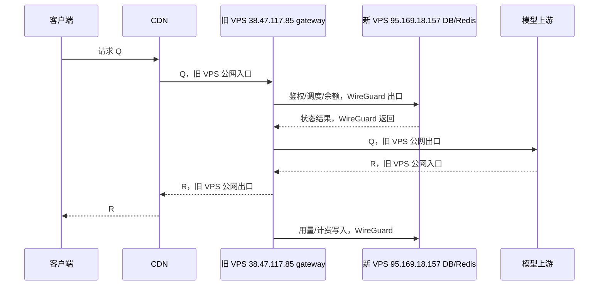

# Sub2API 双 VPS 迁移与 `/v1/responses` 子节点分流实施方案

> 状态：第一批角色化代码和部署模板已在本地实现并通过定向测试；尚未迁移数据库、尚未安装新机组件、尚未切流。
>
> 新方向：将完整 Sub2API、PostgreSQL、Redis 迁移到新 VPS `95.169.18.157`；原生产 VPS
> `38.47.117.85` 降级为只承接部分 `/v1/responses` 的 `gateway` 子节点。
>
> 最后核验日期：2026-07-30（Asia/Shanghai）。生产版本、DNS/CDN、凭证和磁盘状态在每个实施阶段开始前都要重新读取。

## 0. 先说结论

最终拓扑是：

```text
新 VPS 95.169.18.157
  = control 主节点
  = 完整 Sub2API + PostgreSQL + Redis + 管理面 + 后台任务

旧 VPS 38.47.117.85
  = gateway 子节点
  = 只运行 /v1/responses 请求链路
  = 通过 WireGuard 访问新 VPS 的 PostgreSQL/Redis

CDN/边缘调度器
  = 不部署在任意一台 VPS 上
  = 其他请求固定到新 VPS
  = /v1/responses 在新 VPS和旧 VPS之间按权重选择
```

请求命中旧 VPS 时，模型大流量不会绕回新 VPS：

```text
客户端 -> CDN -> 旧 VPS gateway -> 模型上游
客户端 <- CDN <- 旧 VPS gateway <- 模型上游
```

旧 VPS 只把鉴权、调度、余额、计费和用量记录所需的状态请求通过隧道发到新 VPS：

```text
旧 VPS gateway <-> WireGuard <-> 新 VPS PostgreSQL/Redis
```

用户前端的余额、今日用量、RPM、TPM 和费用统一从新 VPS 的共享 PostgreSQL 查询。浏览器不会分别访问两台 VPS，也不会在前端相加。

当前项目没有原生 `gateway-only`/`INSTANCE_ROLE` 模式，必须先完成二开和双节点验证，不能直接把现有应用复制到旧 VPS后切流。

## 1. 两台机器的真实基线

### 1.1 新主 VPS：`95.169.18.157`

SSH 已用 `root` + `~/.ssh/id_ed25519` 通过仅 `publickey` 的非交互方式验证；当前远端没有安装或部署 Sub2API。

| 字段 | 已确认值 | 说明 |
|---|---|---|
| Provider | BandwagonHost KiwiVM | VM ID `2175908`，Node ID `v2923` |
| 面板位置 | `US, California` | California 是州，洛杉矶属于 California |
| IP 地理库 | `Los Angeles, California, US` | 坐标 `34.0522,-118.2437`；不替代供应商机房证明 |
| 公网 IP | `95.169.18.157` | `eth0`，网关 `95.169.16.1` |
| 反向 DNS | `95.169.18.157.16clouds.com` | 当前 PTR 结果 |
| 系统 | AlmaLinux `9.7` `x86_64` | 已 SSH 远端核验 |
| CPU | `3 vCPU`，AMD EPYC-Genoa | 新主节点资源 |
| 内存 | `2.0 GiB`，swap `1.0 GiB` | 核验时可用约 `1.7 GiB` |
| 磁盘 | 根分区约 `40 GB`，ext4 | 核验时已使用约 `5%` |
| 当前监听 | 仅 TCP `22` | 干净节点 |
| 已安装组件 | 无 Docker、Podman、Nginx、WireGuard、firewalld | 需按本文顺序安装 |
| 时钟 | UTC，NTP 已同步 | 应用统一使用 `TZ=Asia/Shanghai` |

面板状态里的：

```text
Running, LA: 0.00 0.01 0.00 1/118 852
```

其中 `LA` 是 Linux load average，不是 Los Angeles。当前位置的两层证据是“供应商面板 California + IP 地理库 Los Angeles”。

### 1.2 旧 VPS：`38.47.117.85`

旧 VPS 是当前生产节点，迁移前仍是唯一线上主节点；迁移完成后降级为 `gateway` 子节点。

2026-07-30 只读核验：

| 字段 | 已确认值 |
|---|---|
| 应用 | Sub2API `0.1.168`，commit `3e11cc865` |
| 容器 | `sub2api` healthy、`sub2api-postgres` healthy、`sub2api-redis` healthy |
| 主机资源 | `1 vCPU`，约 `1.9 GiB` RAM，swap `1 GiB` |
| 磁盘 | 根分区约 `19 GiB`，已使用 `87%`，剩余约 `2.5 GiB` |
| 数据库 | PostgreSQL 数据库约 `1943 MB` |
| Redis | `used_memory_human` 约 `9.22 MB` |
| 应用监听 | `127.0.0.1:8080` |
| Docker 网络 | `sub2api_sub2api-network` |
| 数据库 alias | `postgres`，容器 IP 当时为 `172.18.0.3` |
| Redis alias | `redis`，容器 IP 当时为 `172.18.0.2` |
| 数据库/Redis公网端口 | 当前没有宿主机 port publication |

旧 VPS 磁盘已接近高水位，不能在上面构建 Docker 镜像。迁移后把数据库和 Redis移走，正好释放主要磁盘和内存压力。

## 2. 目标部署表

| 位置 | 角色 | 应用 | 数据 | 对外路径 |
|---|---|---|---|---|
| `95.169.18.157` | `control` 主节点 | 完整 Sub2API | PostgreSQL、Redis、本地数据 | 全部非 Responses；也可承接部分 Responses |
| `38.47.117.85` | `gateway` 子节点 | Responses 最小路由 | 不保存主数据库、不保存主 Redis | 仅按权重承接 `/v1/responses` |
| CDN/边缘 | dispatcher | 路径、健康、权重 | 无业务数据 | 选择一个 origin |

两台应用必须使用同一版本、同一 commit、同一计费和安全配置。差异只允许出现在：

```text
INSTANCE_ROLE
INSTANCE_ID
DATABASE_HOST
REDIS_HOST
本机监听/反向代理
节点日志标签
```

## 3. 迁移后的流量入口、出口和回程

设：

```text
Q = 客户端请求体
R = 模型上游响应体
S = 鉴权、调度、余额、计费、缓存和用量状态通信
```

### 3.1 请求命中新主 VPS

```text
客户端
 -> CDN
 -> 95.169.18.157 本机 Nginx
 -> control Sub2API
 -> 模型上游
 -> control
 -> Nginx
 -> CDN
 -> 客户端
```

数据库/Redis通信在新 VPS 的 Docker 内网中，只有模型上游和客户端的大流量走新 VPS `eth0`。

### 3.2 请求命中旧 VPS 子节点



这里 `R` 不经过新 VPS。新 VPS只接收 `S`，不会接收完整的模型响应流。

### 3.3 用户面板和前端入口

所有前端和面板请求固定进入新主节点：

```text
浏览器 -> CDN -> 95.169.18.157 control -> /api/v1/*
```

特别是：

```text
GET /api/v1/usage/dashboard/stats
GET /api/v1/usage/dashboard/trend
GET /api/v1/usage/dashboard/models
```

不能把这些路径分给旧 gateway，否则旧节点需要承接完整用户面板和 JWT/管理路由，失去“只处理 Codex 请求”的边界。

### 3.4 两台机器的粗略字节方向

对于命中旧 gateway 的请求：

| 节点/接口 | 入口 | 出口 | 大流量含义 |
|---|---:|---:|---|
| 旧 VPS `eth0` | `Q + R` | `Q + R` | 负责模型请求和完整响应 |
| 旧 VPS `wg0` | `S` | `S` | 共享状态，不传 `R` |
| 新 VPS `wg0` | `S` | `S` | 数据层返回和用量写入 |
| 新 VPS Docker 内网 | `S` | `S` | control/数据库/Redis本机通信 |

服务商是否把入口和出口相加，各家口径不同。最终以两台 VPS 服务商流量面板为套餐计费权威，以 `ip -s link`、Nginx 和应用日志解释组成。

## 4. 前端 RPM/TPM 是否聚合

会聚合，并且聚合点在新主 VPS 的 PostgreSQL，不是浏览器。

### 4.1 当前代码路径

用户面板请求：

```text
frontend/src/api/usage.ts
  -> GET /usage/dashboard/stats
backend/internal/handler/usage_handler.go
  -> UsageService.GetUserDashboardStats
backend/internal/repository/usage_log_repo_dashboard.go
  -> SELECT ... FROM usage_logs
```

当前代码计算口径：

| 字段 | 当前实现 |
|---|---|
| `rpm` | 最近 5 分钟该用户 `usage_logs` 记录数除以 5，整数除法 |
| `tpm` | 最近 5 分钟该用户 `input_tokens + output_tokens` 之和除以 5 |
| 今日请求/Token/费用 | 新主 PostgreSQL `usage_logs` 按用户和日期聚合 |
| 累计请求/Token/费用 | 新主 PostgreSQL `usage_logs` 按用户聚合 |
| API Key数量 | 新主 PostgreSQL `api_keys` 按用户统计 |

旧 gateway 处理完请求后，必须将计费和用量写入新主 PostgreSQL。这样新主面板自然看到两台节点的合计：

```text
旧 VPS usage_logs 写入新 PostgreSQL
新 VPS usage_logs 写入新 PostgreSQL
前端从新 PostgreSQL 一次查询
```

前端不会显示“新 VPS 5 RPM、旧 VPS 6 RPM”，因为 `usage_logs` 当前没有 `instance_id` 维度。若以后需要节点拆分，再单独增加节点字段、统计 API 和 UI。

### 4.2 TPM 不等于流量

当前用户面板 `tpm` 不包含 `cache_creation_tokens` 和 `cache_read_tokens`。Codex 长上下文大量使用缓存 Token 时，TPM 不能代表真实网卡流量，也不能作为两台 VPS 套餐配额分配依据。

### 4.3 用量可见时机

1. Responses 请求或 SSE 完成。
2. 处理请求的节点将用量任务提交给本机 worker。
3. worker 通过 WireGuard/本机内网把计费和用量写到新 PostgreSQL。
4. 用户重新进入仪表盘或点击刷新后看到合计。

当前用户仪表盘没有持续定时轮询；长请求未结束时，RPM/TPM 不会提前体现该请求。

## 5. 二开范围和真实代码边界

### 5.1 实例配置

新增配置，默认保持单机兼容：

```text
INSTANCE_ROLE=control|gateway
INSTANCE_ID=new-control|old-gateway
DRAIN_DELAY_SECONDS=...
SHUTDOWN_TIMEOUT_SECONDS=...
```

规则：

- 未配置 `INSTANCE_ROLE` 时默认为 `control`，保证现有部署行为不变。
- `control` 允许 setup、执行数据库 migration 和控制面任务。
- `gateway` 缺少既有 `data/config.yaml` 时拒绝启动；连接共享数据库后只读校验所有 migration 已由 control 应用，不执行 DDL。
- `gateway` 不注册管理面、静态前端和其它模型路由，不启动控制面定时任务。
- `RUN_MODE` 继续使用 `standard`，不能使用 `simple`，因为 `simple` 会关闭计费/额度语义。

### 5.2 gateway 必须保留的能力

旧 VPS 虽然是子节点，仍必须保留：

- API Key 鉴权。
- L1 鉴权缓存和跨实例失效订阅。
- 调度快照读取、数据库回退和全局并发限制。
- RPM/限流、账号冷却、失败状态和分布式锁。
- 请求内 Token 刷新。
- 模型上游请求、SSE、WebSocket、Responses compact 子路径。
- 余额扣减、计费幂等和用量记录 worker。
- 请求路径所需的错误记录、审计和安全检查。

不能因为旧节点“只处理 Codex”就把所有 worker 关闭；用量、并发释放、缓存失效和计费属于请求正确性。

### 5.3 gateway 必须关闭的能力

- setup wizard、数据库 migration 执行权限；gateway 只保留只读 schema 校验。
- 管理后台、登录、注册、支付、静态前端和用户面板路由。
- 定时备份、恢复调度、备份清理。
- 全量账号扫描、定时账号测试、订阅/支付过期扫描。
- 运营聚合、报表、清理和控制面告警。
- 渠道监控调度和不属于 Responses 的批量后台任务。

### 5.4 第一批真实文件

| 文件/模块 | 现状 | 改动 |
|---|---|---|
| `backend/internal/config/config.go` | 没有实例角色 | 增加角色、实例 ID 和 drain 配置 |
| `backend/cmd/server/main.go` | setup 在完整应用初始化前执行，关机超时固定 5 秒 | gateway 跳过 setup；统一按角色启动；drain 后关机 |
| `backend/internal/server/router.go` | 无条件注册所有路由 | control 注册完整路由，gateway只注册最小 Responses/health |
| `backend/internal/server/routes/common.go` | 只有兼容 `/health` | 新增 `/health/live`、`/health/ready` |
| `backend/internal/server/routes/gateway.go` | 全部网关路由混在一个注册函数 | 提取 Responses 最小注册函数 |
| `backend/internal/service/wire.go` | 多个 Provider 构造时直接 `Start()` | 按角色统一 lifecycle，避免旧节点跑备份/聚合 |
| `backend/cmd/server/wire.go`、`wire_gen.go` | 单一完整依赖图 | 注入 role/readiness/lifecycle，重新生成 Wire |
| `backend/internal/service/usage_record_worker_pool.go` | 有界用量 worker 已存在 | gateway保留，并在 drain 时等待提交任务 |
| `deploy/docker-compose.standalone.yml` | app-only Compose 已存在 | 增加 role、ready healthcheck、drain 和本地 data 路径参数 |
| `deploy/docker-compose.local.yml` | 完整 app+Postgres+Redis | 增加 control role、ready healthcheck 和 drain 配置 |
| `deploy/multi-node/` | 当前不存在 | 新增两节点 env、WireGuard、Nginx 和 control 数据端口 override 模板 |

第一阶段不增加 `usage_logs.instance_id`，不迁移客户端 Base URL，不改变计费口径。

### 5.5 健康和摘流

```text
/health/live
  只证明进程和 HTTP Server 存活。

/health/ready
  检查角色、PostgreSQL、Redis和drain状态。
```

schema兼容在进程启动阶段校验：control 可执行缺失 migration；gateway 只读校验，落后或 checksum 不一致时进程拒绝启动。版本、调度快照新鲜度后续作为增强项，不在当前 ready JSON 中虚报。

旧 gateway 的 DB/Redis 隧道断开时必须返回 `503`，边缘停止分配新请求。发布顺序是：先 unready/权重 0，再等待 SSE/WS 和用量 worker，最后退出。

## 6. 新主 VPS 的部署设计

### 6.1 新机目录和组件

新机当前无组件，目标如下：

```text
/opt/sub2api-control/
  docker-compose.local.yml
  .env                         # chmod 600
  data/
  postgres_data/
  redis_data/
  backups/
  patched-binaries/

/etc/nginx/conf.d/sub2api-control.conf
/etc/wireguard/wg0.conf
```

新主运行：

```text
Sub2API control
PostgreSQL 18
Redis 8
Nginx
WireGuard server
firewalld
```

数据库和 Redis 只加入 Docker 内网和 WireGuard relay，不直接绑定公网。

### 6.2 新机安装顺序

执行时保留当前 SSH 会话，先安装防火墙并用第二会话复测 SSH；不要把整段命令盲跑：

```bash
dnf install -y dnf-plugins-core firewalld wireguard-tools nginx
dnf config-manager --add-repo https://download.docker.com/linux/centos/docker-ce.repo
dnf install -y docker-ce docker-ce-cli containerd.io docker-buildx-plugin docker-compose-plugin
```

安装后逐项验证：

```bash
systemctl enable --now firewalld
firewall-cmd --permanent --add-service=ssh
firewall-cmd --reload
systemctl enable --now docker
docker version
docker compose version
```

Nginx 在证书和配置就绪后再启用；不要让默认 vhost 先占用生产端口。

### 6.3 新主 Compose

新主使用完整 Compose，但数据库和 Redis 不发布到公网：

```env
INSTANCE_ROLE=control
INSTANCE_ID=new-control
AUTO_SETUP=false              # 数据恢复后由既有 schema 启动
RUN_MODE=standard
DATABASE_HOST=postgres
DATABASE_PORT=5432
REDIS_HOST=redis
REDIS_PORT=6379
TZ=Asia/Shanghai
```

必须从旧生产配置复制并核对：

```text
JWT_SECRET
TOTP_ENCRYPTION_KEY
数据库用户/数据库名/密码
Redis认证
上游、计费、调度、请求体和流式超时配置
```

新主首次启动前要确认迁移后的数据库已有生产 schema，不能把空库误启动成新的生产实例。

### 6.4 新主 Nginx

新主 Nginx 负责 canonical API、前端、用户面板和所有非 Responses 路径；Responses 也可以由新主直接承接一部分权重。
本机应用仍建议只监听 `127.0.0.1:8080`，Nginx 代理到本机，不把应用端口暴露公网。

## 7. 旧 VPS 子节点部署设计

### 7.1 旧节点配置

```env
INSTANCE_ROLE=gateway
INSTANCE_ID=old-gateway
AUTO_SETUP=false
DRAIN_DELAY_SECONDS=20
SHUTDOWN_TIMEOUT_SECONDS=600
RUN_MODE=standard

DATABASE_HOST=10.20.0.1
DATABASE_PORT=5432
REDIS_HOST=10.20.0.1
REDIS_PORT=6379
TZ=Asia/Shanghai
```

旧节点的应用继续监听本机 `127.0.0.1:8080`，但不再使用本地 PostgreSQL/Redis。迁移完成后原容器和数据卷先保留，不立即删除，便于回滚。

### 7.2 旧节点 gateway Compose

使用 app-only Compose：

- 只启动 `sub2api-gateway`。
- 不声明 `postgres`、`redis` service。
- 只挂载独立的应用 `data/`（包含既有 `config.yaml`）；不挂载旧 PostgreSQL/Redis 数据目录。
- `DATABASE_HOST` 和 `REDIS_HOST` 指向 WireGuard 的新主地址。
- 容器端口只绑定 `127.0.0.1:8080`。
- 健康检查使用 `/health/ready`。
- 资源起步值要适配旧 VPS 的 1 vCPU/1.9 GiB；连接池、worker 并发和日志轮转必须实测。

### 7.3 旧节点 Nginx

旧节点 Nginx 只允许：

```text
/v1/responses
/v1/responses/*
/responses
/responses/*
/backend-api/codex/responses
/backend-api/codex/responses/*
/health/live
/health/ready
```

其他 URI 在应用层和 Nginx 层都返回 `404`。必须支持：

```nginx
proxy_http_version 1.1;
proxy_buffering off;
proxy_request_buffering off;
proxy_cache off;
proxy_read_timeout 7200s;
proxy_send_timeout 7200s;
proxy_set_header Upgrade $http_upgrade;
proxy_set_header Connection $connection_upgrade;
proxy_pass http://127.0.0.1:8080;
```

正式配置要补齐 TLS、`map $http_upgrade`、CDN/运维来源白名单、真实 IP 识别、访问日志和不泄露内部头的规则。

## 8. WireGuard 和数据层访问

### 8.1 点对点地址

```text
新主 VPS：10.20.0.1/30
旧 gateway：10.20.0.2/30
```

只为对端地址配置 `AllowedIPs`，不把 WireGuard 设为默认路由：

```text
新主 peer AllowedIPs：10.20.0.2/32
旧 gateway peer AllowedIPs：10.20.0.1/32
旧 gateway PersistentKeepalive：25 秒
```

这样只有访问新主数据库/Redis的 `S` 进入 `wg0`；旧 gateway 到模型上游的 `Q/R` 继续从自己的公网 `eth0` 直接进出。

### 8.2 端口矩阵

| 机器 | 监听 | 允许来源 | 用途 |
|---|---|---|---|
| 新主 | UDP `51820` | 旧 VPS `38.47.117.85` | WireGuard |
| 新主 | `10.20.0.1:5432` | `10.20.0.2` | PostgreSQL relay |
| 新主 | `10.20.0.1:6379` | `10.20.0.2` | Redis relay |
| 新主 | TCP `443` | CDN/运维来源 | 主 origin |
| 新主 | `127.0.0.1:8080` | 本机 | Nginx -> control |
| 旧 gateway | UDP `51820` | `95.169.18.157` | WireGuard |
| 旧 gateway | TCP `443` | CDN/运维来源 | 子节点 origin |
| 旧 gateway | `127.0.0.1:8080` | 本机 | Nginx -> gateway |

绝不出现：

```text
0.0.0.0:5432
0.0.0.0:6379
0.0.0.0:8080
```

### 8.3 新主 relay

新主的 PostgreSQL/Redis在 Docker 内网，第一选择使用单独 relay sidecar，不重建、不重启数据容器：

```text
10.20.0.1:5432 -> relay -> postgres:5432
10.20.0.1:6379 -> relay -> redis:6379
```

当前旧节点真实 Docker 网络为 `sub2api_sub2api-network`，数据库 alias `postgres`、Redis alias `redis`；新主迁移后要以新机真实网络名再次读取。

relay 规则：

- 单独 Compose 文件，加入新主的 Sub2API Docker 网络。
- `ports` 只绑定 `10.20.0.1`，不绑定 `0.0.0.0`。
- firewalld只允许 `wg0` 对端 `10.20.0.2`访问。
- Redis继续使用认证；PostgreSQL只允许应用账号和目标数据库。
- relay停止不会影响新主 control 访问自己的 Docker 内网。

上线前在旧 gateway 端验证：

```bash
wg show
ping -c 5 10.20.0.1
nc -vz -w 3 10.20.0.1 5432
nc -vz -w 3 10.20.0.1 6379
PGPASSWORD="$DATABASE_PASSWORD" psql -h 10.20.0.1 -U "$DATABASE_USER" -d "$DATABASE_DBNAME" -c 'select 1'
REDISCLI_AUTH="$REDIS_PASSWORD" redis-cli -h 10.20.0.1 -p 6379 ping
```

不要把密码直接写进 shell history；变量只是验收占位符。

## 9. 迁移实施步骤

这是一次“先把主站迁移到新机，再把旧机降级为子节点”的迁移，不是在线双写。第一阶段必须安排维护窗口，避免旧库在导出期间继续发生余额和用量写入。

### 9.1 迁移前冻结

1. 重新读取旧 VPS 版本、commit、容器状态、数据库大小、Redis状态和磁盘。
2. 新 VPS 安装基础软件，但暂不把域名和 CDN 指向新机。
3. 建立新主本地 PostgreSQL/Redis 和 app 容器，确认空库不会接收公网流量。
4. 备份旧 PostgreSQL、Redis RDB、`/www/sub2api/data`、旧二进制和 `.env`。
5. 保留旧 SSH 会话、旧应用容器和旧数据卷，直到新主通过完整验收。

### 9.2 停流和最终备份

1. CDN/反向代理先进入维护或将旧 origin 设为 draining，不接受新请求。
2. 等待已有 SSE/WebSocket 和普通 Responses 完成。
3. 停止旧 Sub2API 应用，保留 PostgreSQL/Redis运行。
4. 执行最终 PostgreSQL `pg_dump -Fc`，记录文件 SHA256。
5. 让 Redis 生成 RDB 快照并复制出来；Redis是缓存/共享运行态，RDB只作为备份，不盲目恢复过期 leader lock。
6. 复制 `/www/sub2api/data/` 和当前必要配置，密钥文件权限保持 `600`。

### 9.3 传输和恢复

示例路径（执行时替换占位符，不在命令中打印密码）：

```bash
# 旧 VPS：导出 PostgreSQL
docker exec sub2api-postgres pg_dump -U sub2api -d sub2api -Fc -f /tmp/sub2api-final.dump
docker cp sub2api-postgres:/tmp/sub2api-final.dump /tmp/sub2api-final.dump
sha256sum /tmp/sub2api-final.dump

# 旧 VPS -> 新 VPS：走 SSH 传输
scp /tmp/sub2api-final.dump root@95.169.18.157:/tmp/
```

新主恢复顺序：

```text
确认新 PostgreSQL 是空目标库且未接收公网
-> 停止新主 Sub2API app
-> pg_restore --clean --if-exists --no-owner
-> 恢复 data 目录和经过筛选的固定配置
-> Redis 先保留 RDB 备份；优先空 Redis 启动并观察 scheduler/cache rebuild
-> 只有验证 RDB 兼容且不会恢复旧 leader lock 时才导入 RDB
-> 启动新主 control
```

PostgreSQL 是余额、用户、账号、用量和计费的权威数据，必须恢复成功；Redis可在验证后从空库重建，不能为保存缓存而引入陈旧锁。

### 9.4 新主内部验收

新主先用源站或运维 hosts 直连，不接公共 CDN：

```text
/health/live = 200
/health/ready = 200
/api/v1/settings/public 可读取目标版本
/v1/models 和真实 API Key 请求符合预期
/v1/responses 非流式成功
/v1/responses stream/SSE 成功
/api/v1/usage/dashboard/stats 可读取迁移后的历史数据
后台登录、API Key、余额、账号池、调度和计费可用
```

新主必须验证数据库的历史用户、API Key、账号和用量数量与旧备份一致，不能只看服务启动成功。

### 9.5 切换主站

1. 将 canonical origin 指向 `95.169.18.157`。
2. 其他所有路径固定新主。
3. Responses 暂时只走新主，权重 `LA=0`。
4. 观察新主外部健康、Nginx 502、数据库连接池、Redis和费用写入。
5. 通过 24 小时基础观察后，再把旧 VPS配置成 gateway 子节点。

### 9.6 旧节点降级

1. 旧 VPS 保留原数据库和 Redis 容器及备份，先不删除。
2. 在旧 VPS 上安装/启用 WireGuard 客户端，连接新主 `10.20.0.1`。
3. 通过隧道验证 PostgreSQL `select 1` 和 Redis `PING`。
4. 部署同 commit 的 gateway app-only 镜像。
5. 验证 gateway 不注册管理面、不执行 migration、不启动控制面定时任务。
6. 直连旧 origin 验证 `/health/ready`、Responses、SSE、WS和用量写入。
7. 旧 origin 通过后，才在边缘层给 `/v1/responses` 分配第一档 `10%` 权重。

## 10. 边缘分流

CDN/边缘调度器不部署在任意 VPS。当前历史核验只确认域名经过 CDN 代理，不能假设已经有按路径双源站 Load Balancer。

### 10.1 选型顺序

| 方案 | 结论 |
|---|---|
| Cloudflare Load Balancing + HTTP 路径规则 | 账户套餐支持时优先，源站池和健康检查更直接 |
| Cloudflare Worker dispatcher | 没有 LB 时评估；必须实测大请求体、SSE、WS、超时和费用 |
| DNS 多 A/轮询 | 不能按 `/v1/responses` 分流和按字节控量，不作为生产方案 |

两个 origin：

```text
ORIGIN_NEW = 95.169.18.157，新主 control
ORIGIN_OLD = 38.47.117.85，旧 gateway
```

边缘规则：

```text
/v1/responses*、/responses*：ORIGIN_NEW 和 ORIGIN_OLD 按健康和权重选择
其他所有路径：100% ORIGIN_NEW
```

要求：

- 保留 HTTP 方法、Authorization、请求体和查询参数。
- Responses 请求和响应禁止缓存。
- SSE/WS 不缓冲、不自动重放 POST。
- 一条连接从建立到结束固定在最初选中的 origin。
- 只有 `/health/ready` 成功的节点能获得新请求。
- origin 的 443 只接受 CDN 和运维探测来源；8080不开放公网。

权重推进：

```text
阶段 0：新主 100%，旧 gateway 0%（仅直连验收，不算正式灰度）
阶段 1：新主 90%，旧 gateway 10%（第一档正式流量，观察至少 24 小时）
阶段 2：新主 80%，旧 gateway 20%（第一档稳定后再推进）
阶段 3：按两台服务商实际出口 GB 和长上下文比例动态调整
```

请求数权重不等于字节权重。Codex长上下文和长输出必须按 `eth0` 实际字节修正。
`90/10` 是边缘层的新请求权重，不保证两台服务商面板最终恰好显示 90%/10% 字节；长响应会让旧 gateway 字节占比偏高。

## 11. 测试和验收

### 11.1 代码单元测试

- 默认角色为 `control`。
- 非法角色启动失败。
- gateway 强制跳过 setup，并只读校验 migration。
- gateway 只注册 Responses/health 路由。
- control 注册完整应用路由。
- gateway 不启动备份、聚合、扫描和支付过期任务。
- `ready` 能反映 DB/Redis 隧道故障。
- draining 返回 `503`，并等待 SSE/WS和用量 worker。

### 11.2 双实例集成测试

```text
新主：PostgreSQL + Redis + control
旧节点：gateway
共享：同一 API Key、同一用户、同一账号池、同一 Redis
```

必须验证：

1. 同一个 API Key 在新主和旧 gateway 都能鉴权。
2. 新主禁用 API Key 或修改分组后，旧 gateway L1 缓存能失效。
3. 两台同时调度时，并发、RPM、额度、账号冷却和错误状态一致。
4. 旧 gateway 的计费/用量写入新主 PostgreSQL，不丢不重。
5. 旧 gateway DB/Redis断开后 ready 失败且停止新流量。
6. Responses 非流式、SSE、WebSocket、compact和长请求均不缓冲。
7. 单一 request_id 不会被两个 origin 自动重放。
8. 新主管理面、登录、前端和支付仍可用。

### 11.3 前端聚合测试

使用同一测试用户：

1. 发一条请求固定命中新主。
2. 发一条请求固定命中旧 gateway。
3. 在新主面板读取 `/api/v1/usage/dashboard/stats`。
4. 两边各完成至少 5 条请求后，再验证 RPM整数除法。

必须看到：

```text
新主和旧 gateway 的 usage_logs 都在新 PostgreSQL
total/today/cost/token 包含两边请求
rpm = 最近 5 分钟两节点总请求数 / 5
tpm = 当前代码口径的 input_tokens + output_tokens / 5
```

如果旧 gateway 日志有成功响应但新 PostgreSQL没有 usage_logs，立即把旧 gateway 权重设为 0。

### 11.4 直连 origin 命令

```bash
ORIGIN_HOST=ORIGIN_OLD_HOST
ORIGIN_IP=38.47.117.85

curl --noproxy '*' --resolve "$ORIGIN_HOST:443:$ORIGIN_IP" -ksS --fail \
  "https://$ORIGIN_HOST/health/live"
curl --noproxy '*' --resolve "$ORIGIN_HOST:443:$ORIGIN_IP" -ksS --fail \
  "https://$ORIGIN_HOST/health/ready"
curl --noproxy '*' --resolve "$ORIGIN_HOST:443:$ORIGIN_IP" -N -sS \
  -H "Authorization: Bearer $TEST_API_KEY" \
  -H 'Content-Type: application/json' \
  --data-binary @responses-test.json \
  "https://$ORIGIN_HOST/v1/responses"
```

新主 origin 也执行同一组测试。不得把测试 API Key、请求正文和响应正文写入文档或日志。

## 12. 监控、流量和告警

两台至少记录：

```text
eth0 ingress/egress
wg0 ingress/egress
Nginx request_count/body_bytes_sent/request_time/upstream_response_time
Responses 4xx/5xx/499/502/503
SSE 中途断流率
数据库连接池等待、查询 p95
Redis PING/命令 p95
usage worker waiting/completed/failed/dropped/sync fallback
ready 状态和 drain 状态
```

新主和旧 gateway 日志都增加固定 `instance_id`，但不得记录 Authorization、API Key、Token、请求正文或模型输出。

前端 RPM/TPM是用户合计，不作为节点流量监控；节点请求数从 Nginx/应用日志取，套餐流量从服务商面板取。

建议每日报表：

| 指标 | 新主 `95.169.18.157` | 旧 gateway `38.47.117.85` |
|---|---:|---:|
| 公网入口 GB |  |  |
| 公网出口 GB |  |  |
| WireGuard 入口 GB |  |  |
| WireGuard 出口 GB |  |  |
| `/v1/responses` 请求数 |  |  |
| `/v1/responses` 响应字节 |  |  |
| 首包 p95 |  |  |
| SSE 断流率 |  |  |
| 5xx比例 |  |  |

## 13. 回滚

### 13.1 迁移失败回滚

在新主正式切流前：

```text
停止新主公共入口
-> CDN/DNS 恢复旧 VPS origin
-> 旧 VPS 原应用、PostgreSQL、Redis继续运行
-> 核对旧版本、health、API Key、余额和计费
```

因此迁移窗口期间不能删除旧数据卷、旧 `.env`、旧二进制和旧 Compose。

### 13.2 子节点故障回滚

```text
旧 gateway 权重 = 0
新主权重 = 100
```

只要新主 control/data健康，旧子节点故障不会影响新主。不要让新主反向代理旧 gateway，否则旧节点的模型响应会重新穿回新主，失去流量分担意义。

### 13.3 新主故障

新主是数据层单点；如果 PostgreSQL/Redis或新主应用故障，两台都可能不可用。应优先恢复新主数据层，再恢复应用；不能仅把旧 gateway 权重调高来绕过新主数据层。

### 13.4 节点失陷

旧 gateway 持有生产数据库/Redis凭证。怀疑旧节点失陷时：

```text
旧 gateway 权重 = 0
新主防火墙阻断旧 peer
轮换数据库/Redis凭证和可能暴露的固定密钥
审计数据库、Redis、API Key和账号访问记录
重装旧 VPS后再重新纳管
```

## 14. 开工顺序

### 14.1 已完成

- [x] 新 VPS `95.169.18.157` 购买完成，SSH publickey 登录验证通过。
- [x] 新 VPS 位置核对为 California 区域，IP 地理库为 Los Angeles。
- [x] 新 VPS资源、磁盘、时钟、监听和软件基线只读盘点完成。
- [x] 旧 VPS `38.47.117.85` 当前版本、容器、数据库、Redis、网络和资源只读刷新完成。
- [x] 已决定改为“新主 control + 旧 gateway 子节点”的拓扑。
- [x] 已确认前端统计从共享 `usage_logs` 聚合，第一阶段无需前端改动。
- [x] 已增加 `control/gateway` 角色、实例 ID、ready/live 和两阶段 drain。
- [x] gateway 已收窄到 Responses/health 路由，静态前端和控制面路由不注册。
- [x] gateway 已停止备份、聚合、扫描、定时测试、支付过期和批量任务等控制面 worker。
- [x] gateway 已改为只读校验数据库 migration；control 保留 migration 执行权。
- [x] control/gateway Compose、Nginx、WireGuard 和 env 模板已加入 `deploy/multi-node/`。
- [x] 配置、路由、repository、service、server 和 Wire 定向测试通过；两套 Compose 模板展开通过。

### 14.2 第一批代码任务

1. [x] 增加实例角色、路由最小集、ready/live和 drain。
2. [x] 收敛构造即启动的后台任务，明确 control/gateway启动清单。
3. [x] 保留 gateway 的调度、计费、用量、SSE/WS和缓存失效能力。
4. [x] 新增 gateway Compose、Nginx和 WireGuard 模板。
5. [ ] 完成真实 PostgreSQL/Redis 双实例集成测试和计费/用量聚合测试。
6. [ ] 本地构建同一 `linux/amd64` 镜像，禁止在旧 VPS上构建。

### 14.3 第二批基础设施任务

1. 新 VPS安装 Docker、PostgreSQL、Redis、Nginx、WireGuard和firewalld。
2. 迁移 PostgreSQL、应用 data、固定密钥和必要 Redis状态。
3. 新主完整验收后切换 canonical origin。
4. 旧 VPS安装 WireGuard客户端和 gateway app-only 运行环境。
5. 旧 gateway通过隧道访问新主数据层并完成直连验收。
6. 边缘 `/v1/responses` 先按 0% 接入旧 gateway 做直连验收，再进入 `90% 新主 / 10% 旧 gateway` 的第一档正式灰度。

### 14.4 正式完成定义

```text
新主 control 可独立运行完整 Sub2API
旧 gateway 只能处理 Responses/health
旧 gateway 的计费和用量可写入新主 PostgreSQL
新主面板能聚合两节点统计
数据库/Redis未暴露公网
SSE/WS和长上下游连接通过
90%/10%第一档灰度至少观察24小时
两台均有流量、健康、日志、版本和回滚证据
```

满足这些条件前，不把“迁移完成”或“流量已分担”作为结论。
